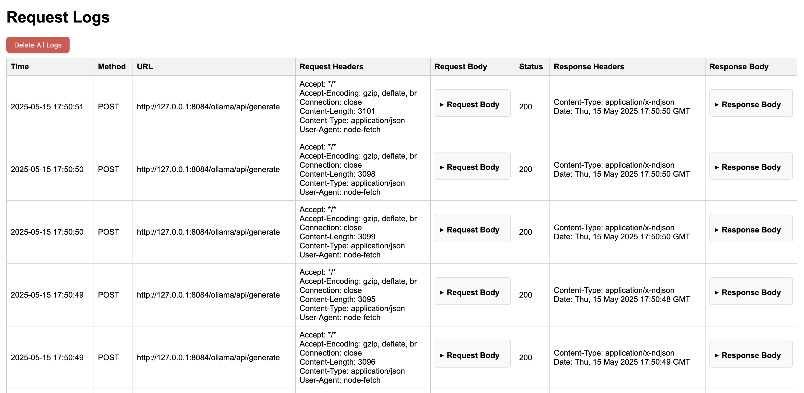

# ProxyMini

ProxyMini is a lightweight proxy server written in Go that provides HTTP request logging capabilities

## Configuration

### Environment variables

- `PROXYMINI_PORT`: The port on which the ProxyMini server will listen. Default is 14443.
- `PROXYMINI_CONFIG`: The path to the TOML configuration file. Default is "proxymini.conf.toml".
- `PROXYMINI_DB`: The path to the database file used for request logging. Default is "rl.db".

### Configuration file

ProxyMini uses a TOML file to define proxy routing rules. Example config:
```toml
# Optional: retention period in seconds for request logs
# Logs older than this will be automatically deleted
retention = 86400  # 24 hours

[[proxy]]
prefix = "/api"
target = "http://api-server:8080"

[[proxy]]
prefix = "/auth"
target = "http://auth-service:9000"
```

More specific rules should be before more general ones.

## Runtime commands

ProxyMini now runs on Platforma's `application` + `httpserver` packages.

```shell
# start proxy server
go run ./cmd/proxymini run

# show available commands
go run ./cmd/proxymini --help
```

### SQLite migrations

ProxyMini still uses SQLite for request logs.

- SQLite schema migration runs automatically during `run` as a startup task.
- `migrate` command is intentionally a no-op for SQLite, because Platforma's native database migration command targets PostgreSQL repositories.

## Web UI

ProxyMini includes a web interface for viewing request logs. Access it by navigating to `/app`



### Frontend Development (SvelteKit + Bun)

The UI source lives in `webui/` and is built as a static site into `webapp/static/`.
The `webapp/static/` contents are generated and are not committed to git.

Prerequisites:
- [Bun](https://bun.sh/)
- [Task](https://taskfile.dev/) (recommended command runner)

Common commands:
```shell
# install frontend dependencies
task ui:install

# build static UI into webapp/static
task ui:build

# run sveltekit dev server
task ui:dev

# build UI + backend binary
task build

# run UI checks + backend tests
task test
```

## Deployment

Download binary from [release page](https://github.com/mishankov/proxymini/releases) or use [docker image](https://github.com/mishankov/proxymini/pkgs/container/proxymini):

```shell
docker pull ghcr.io/mishankov/proxymini:latest
```

### Docker compose example

```yml
services:
  proxy:
    image: ghcr.io/mishankov/proxymini:latest
    ports:
      - "14443:14443"
    volumes:
      # mapping config file to container
      - ./proxymini.conf.toml:/app/proxymini.conf.toml:ro
      # mapping folder with database
      - ./data:/app/data:rw
```
